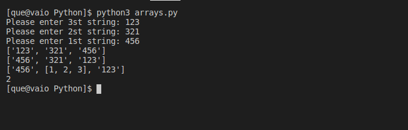
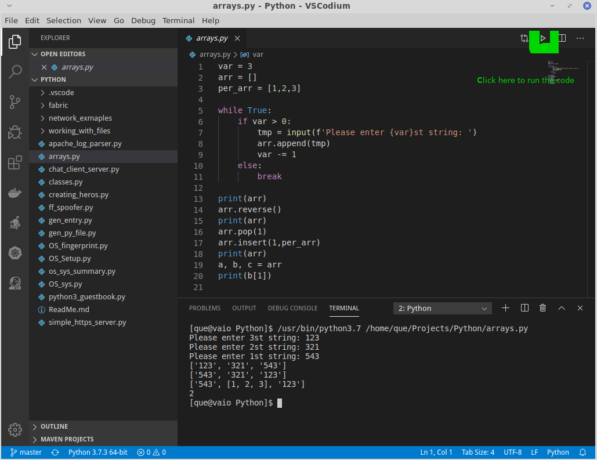

# Python Syntax
---


Python syntax can be executed by writing directly in the Command Line: 

Or by creating a python file on the server, using the .py file extension, and running it in the Command Line: 


### Python Indentation

Indentation refers to the spaces at the beginning of a code line.
Where in other programming languages the indentation in code is for readability only, the indentation in Python is very important.
Python uses indentation to indicate a block of code:
```py
if 5 > 2:
    print("Five is greater than two!")      #<-- 4 space indentation
```
Python will give you an error if you skip the indentation:

```py
if 5 > 2:
print("Five is greater than two!")  #<-- NO INDENTATION
```


### Python Variables

In Python variables are created the moment you assign a value to it:
```py
x = 5
y = "Hello, World!
```
Unlike other programming languages, Python has no command for declaring a variable.
A variable is created in memory, the moment you first assign a value to it.


### Comments

In computer programming, a comment is a programmer-readable explanation or annotation in the source code of a computer program. They are added with the purpose of making the source code easier for humans to understand, and are generally ignored by compilers and interpreters. The syntax of comments in various programming languages varies considerably. 


#### Creating a Comment

In Python , in general, comments starts with a `#`, and once Python gets to line where they reside , it will ignore them:

```py
#This is a comment
print("Hello, World!")
```
Comments can be placed at the end of a line, and Python will ignore the rest of the line:

```py
print("Hello, World!") #This is a comment
```
Comments does not have to be text to explain the code, it can also be used to prevent Python from executing code:

```py
#print("Hello, World!")
print("Cheers, Mate!")
```
### Multi Line Comments

Python does not really have a syntax for multi line comments.

To add a multiline comment you could insert a # for each line:

```py
#This is a comment
#written in
#more than just one line
print("Hello, World!")

```

Or, not quite as intended, you can use a multiline string.
Since Python will ignore string literals that are not assigned to a variable, you can add a multiline string (triple quotes) in your code, and place your comment inside it:

```py
"""
This is a comment
written in
more than just one line
"""
print("Hello, World!")
```
As long as the string is not assigned to a variable, Python will read the code, but then ignore it, and you have made a multiline comment.
